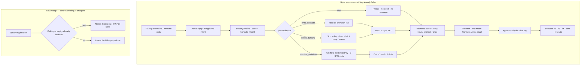

# Architecture

Piplup is a **policy-gated recovery agent** for [Razorpay AI Buildathon](https://razorpay.com/buildathon/) Track 03 — AI Revenue Recovery. It is not a chatbot that retries payments.

Demo merchant: **Eureka Labs** (Hyderabad). Product: monthly AI/ML course AutoPays. Book: **112 labeled failures** out of 1,240 billed seats in Cycle 47.

The night loop recovers money that already bounced. A second, earlier loop flags next cycle’s debits that are already guaranteed to fail.

Screen-share this file, or open the same diagram at [`/architecture`](http://localhost:3000/architecture) while `npm run dev` is running.

## System map

Two loops. Same policy gate. Money does not move unless `grantAdaptive` allows it.

Read the night loop left to right as: **see why it failed → decide if we are allowed to act → change the next attempt → spend an NPCI slot only if the debit can work → write the decision down → prove it against T+3.**

## Where each tool sits

This is the AI-judgment diagram. An LLM does not classify declines and does not grant money.

## AI layer — the only place a model is allowed

The implementable slot is **step 2: read the student’s message**. Everything after that stays rules.

| | |
| --- | --- |
| **Sits on** | Raw inbound text (Hinglish / English) |
| **Returns** | `promise_to_pay` · `dispute` · `already_paid` · `opt_out` · `unclear`, plus a day if they promised one, plus a confidence |
| **Guard** | Confidence below 0.6 → ignore. Same as today’s rules. |
| **Fallback** | [`reply.ts`](src/lib/recovery/reply.ts) regex if the model is down |
| **Never** | Classify the decline. Never call `grantAdaptive`. Never spend an NPCI slot. |

That is the layer a judge can see on `/architecture` (the card marked **AI**). Today the regex already does the job on the seeded book. Wiring Groq/OpenAI is a drop-in behind the same types — not a new money path.

Screen-share the full-viewport poster at [`/architecture`](http://localhost:3000/architecture) (press F11). Do not record the Excalidraw strip.

```mermaid
flowchart LR
  subgraph rules["Rules — must not hallucinate"]
    R1[Decline class]
    R2[Policy grant]
    R3[Contact freeze]
    R4[RBI 24h notice]
    R5[Domestic-card: link only]
  end

  subgraph scored["Scored model — Stripe method, small book"]
    S1[Day × hour grid]
    S2[Five signal families]
    S3[Leave-one-out base rate]
    S4[EV floor before spending a slot]
  end

  subgraph arith["Arithmetic — not a prediction"]
    A1[Invoice vs mandate ceiling]
    A2[Card / mandate expiry vs billing day]
  end

  rules --> scored
  scored --> arith
```

| Layer | File | What a human is allowed to trust it with |
| --- | --- | --- |
| Reply parse | [`src/lib/recovery/reply.ts`](src/lib/recovery/reply.ts) | Hinglish → promise / dispute / paid / opt-out. Confidence &lt; 0.6 is ignored. |
| Taxonomy | [`src/lib/recovery/taxonomy.ts`](src/lib/recovery/taxonomy.ts) | Six decline classes. Never inferred by a language model. |
| Grant | [`src/lib/recovery/policy.ts`](src/lib/recovery/policy.ts) | The only door money can walk through. |
| Windows | [`src/lib/recovery/windows.ts`](src/lib/recovery/windows.ts) | When to present. Readable log-odds, not a black box. |
| Ladder | [`src/lib/recovery/ladder.ts`](src/lib/recovery/ladder.ts) | The whole cycle, priced. Guardrails live here. |
| Baseline | [`src/lib/recovery/baseline.ts`](src/lib/recovery/baseline.ts) | T+3 all, and T+3 that stops after a hard decline. |
| Simulate | [`src/lib/recovery/simulate.ts`](src/lib/recovery/simulate.ts) | What would have cleared, used only to score. |
| Evaluate | [`src/lib/recovery/evaluate.ts`](src/lib/recovery/evaluate.ts) | Incremental lift, net of cost, correct refusals. |
| Prevent | [`src/lib/recovery/prevent.ts`](src/lib/recovery/prevent.ts) | Failures that are already certain, three days out. |
| Analytics | [`src/lib/recovery/analytics.ts`](src/lib/recovery/analytics.ts) | Same book the desk ran. No second pipeline. |
| Executor | [`src/lib/razorpay/executor.ts`](src/lib/razorpay/executor.ts) | Test-mode links only. Live keys refused. |
| Desk | [`src/components/desk/Desk.tsx`](src/components/desk/Desk.tsx) | Night-loop shell. Tab bodies: `payments.tsx`, `boards.tsx`. Reports / Prevent sit in `src/components/insights`. |

## Three ways to act, plus a freeze

| Clock | When | Stripe analog | Piplup on Indian rails |
| --- | --- | --- | --- |
| Sync cascade | Bank-side technical decline | Adaptive Acceptance | Slow switch: hold 8s, re-present same rail. CBS down: cascade to another rail. Either way the customer sees nothing. |
| Async dunning | Financial / instrument / checkout | Smart Retries | Score every day × hour window and present at the best one. Domestic card means a link, never a silent charge. |
| Terminal mutation | Mandate revoked | — | The debit is over, the customer is not. Ask for a fresh AutoPay. **Costs zero NPCI slots.** |
| Stop | Chargeback / opt-out / already paid | Excessive-retry prevention | No debit and no message. Counts as a correct decision. |

## Six decline classes on the 112-case book

| Class | n | What it means | Mutation |
| --- | --- | --- | --- |
| Technical | 25 | Bank slow or bank down — two opposite fixes | Hold 8s **or** switch rail |
| Financial | 26 | Empty account until payday, including the hour salary posts | Wait, then debit or link |
| Instrument | 15 | Expired card or paused mandate | Link or re-auth — do not replay the dead tool |
| Terminal | 31 | Revoked mandate, chargeback, opt-out, already paid | Re-auth **or** freeze |
| Behavioral | 5 | Checkout abandoned | Payment link only |
| Uncollected | 10 | Revived subscription, invoices never charged | Sweep invoices |

T+3 treats most of these as “failed, retry tomorrow.” The mix is ugly on purpose so a single retry trick cannot fake the scoreboard.

## When to present: the window model

Stripe's [Smart Retries writeup](https://stripe.com/blog/how-we-built-it-smart-retries) replaced a fixed dunning
schedule with a model that scores candidate retry windows and picks the best. We cannot train on billions of
payments and do not pretend to. What ports is the method:

| Stripe | Piplup |
| --- | --- |
| Fixed schedule → learned timing | Score the whole day × hour grid, take the argmax |
| 500+ features in five families | Five signals in the same five families, each one a thing a merchant already holds |
| Heavy model, because a retry days out has no latency budget | Exhaustive search over 70 windows per case, for the same reason |
| Retry until the budget runs out | Spend a slot only when expected value clears a floor |
| Merchant sets the envelope, model picks inside it | Same, except NPCI already fixed the ceiling at 4 attempts |
| Publish a benchmarked default | `sweepEnvelopes()` re-runs the batch under 15 envelopes and ranks them |

[`windows.ts`](src/lib/recovery/windows.ts) scores each window additively in log-odds, so the pick can be read
back rather than taken on trust. The base rate per decline code is measured on the labelled batch **leave-one-out**,
so a case never contributes to its own prior. Everything else is Indian-rail mechanics we can state:

- **Customer** — declared payday, promise-to-pay parsed from the reply, instrument seen clearing elsewhere, and the
  days this customer's debit cleared in previous cycles. The cascade this replaced read the first of those that
  matched and ignored the rest; the model adds all of them, which matters when a customer declares the 1st and has
  cleared on the 7th three cycles running.
- **Seasonality** — the hour. This is the load-bearing one. Indian payroll posts in the morning clearing batch, so a
  debit presented at 02:00 on payday is presented against yesterday's balance. The calendar cycle presents at 02:00
  every time, which is how a fixed schedule loses a payday it actually reached.
- **Payment** — the measured base rate for the decline code.
- **Rail** — UPI AutoPay presents 24×7; eNACH settles in batches.
- **Merchant** — drift off the billing date, and exposure size.

### The envelope

The merchant owns the boundary and the model owns the interior. `dropDeadDay`, `maxAttempts` and `finalAction` are
merchant settings; `envelopeFor()` then clamps `maxAttempts` against what NPCI and the mandate actually allow, so a
merchant can ask for fewer attempts but never more.

`npm run evaluate` prints the full sweep. On this book the best envelope is **14 days × 2 attempts** — the same
two-week window Stripe recommends, at a fraction of the attempts, because NPCI grants four and Stripe's card rails
grant eight. A third attempt recovers nothing more and costs a slot.

### When the hour is unknowable

No merchant-visible signal says that a customer's employer runs payroll at 18:00. The model does not guess it; it
buys a second window instead. That is what `maxAttempts: 2` is for, and it is why the sweep prefers it over one.

## The NPCI budget guard

NPCI allows **1 original debit + 3 retries** on a mandate. That budget is the scarce resource, so the engine
counts it explicitly (`npciSlotsUsed` on every decision) and only three mutations spend from it:
`same_rail_retry`, `cooldown_retry`, `next_rail`.

Links, re-auth requests and invoice sweeps are **out of band** and cost nothing. Two consequences:

- A revoked mandate is worth chasing, just never with a debit.
- Running out of budget does not end recovery. `allow()` downgrades a debit to a payment link rather than
  stopping, because the mandate is exhausted, not the customer.

Correctness is therefore scored as **"spent no NPCI slot on a case that must not be debited"**, not as
"did nothing".

## Bank, not rail, decides the cascade

A technical decline is a statement about a bank. The seed labels which kind:

| Bank signal | What clears it | What does not |
| --- | --- | --- |
| `latency_spike` | Holding a few seconds and re-presenting the same rail | Cascading — the backup rail sits behind the same slow bank |
| `cbs_down` | Routing to another rail | Holding — core banking is not coming back in 8 seconds |

Both branches are load-bearing on the batch: a policy that always cascades loses the latency cases, and one
that always waits loses the CBS cases.

## The ladder is the cost model

A grant says what to do once. [`ladder.ts`](src/lib/recovery/ladder.ts) expands it into the whole cycle: each step
carries a day, an hour, a channel, a price in paise, and the NPCI slots it spends. Guardrails are enforced in the
builder rather than documented as intent — contact only at 10:00 IST, quiet hours 21:00–09:00, a 3-message cap per
cycle, and a terminal `stop` step on a known day.

Both policies are priced off the steps they actually ran, so `costPaise` on an attempt is the sum of its ladder.
Steps planned but skipped — because the money landed earlier, or a cap blocked them — cost zero and stay visible.
The baseline gets its own builder that deliberately does **not** apply our guardrails; capping the calendar's
messages would flatter its cost.

## Prevention

[`prevent.ts`](src/lib/recovery/prevent.ts) is the only part of the system that runs before a failure. It does not
predict: a UPI AutoPay mandate is approved up to a ceiling, so an invoice above that ceiling is a debit that
mathematically cannot clear, and a mandate or card that lapses before the billing date is a failure with a date on
it. Each finding becomes a notice three days ahead, priced at one message and zero NPCI slots, against the four
slots the calendar would spend discovering the same fact on the billing day.

## Analytics

[`analytics.ts`](src/lib/recovery/analytics.ts) derives from the same batch the scoreboard scores — no second
pipeline. It reproduces Stripe's published KPI set (failure rate, recovery rate by volume, recovered / in recovery
/ not recovered, recovered volume by method, failed volume by decline reason, top customers in recovery) and adds
NPCI slots per method, a by-bank breakdown, and paise spent per rupee recovered.

"In recovery" is defined against an `asOfDay` cursor: a case whose next unskipped ladder step falls after that day
has not failed, it simply has not been tried yet.

## Measurement

The Track 03 bar is measured money recovered across a batch, with stopping rules and an audit trail. The harness is how we show it.

| Metric | Why it exists |
| --- | --- |
| Incremental lift | Cases the baseline would have won anyway are not our win |
| Net of chase cost | Messages and notices cost money; gross recovery hides it |
| Correct refusals | Money we deliberately did not chase, and NPCI slots saved |
| NPCI debits vs out-of-band | Recovering with a link is not the same as spending a mandate retry, so they are counted separately |

`npm run evaluate` prints Adaptive against **T+3 all** and **T+3 charitable**. Lift has to survive both. The uncollected-invoice sweep is reported as its own share of incremental lift, because the calendar flow has no path to that money at all.

## Desk surfaces, mapped to the engine

| Tab | What Ada is looking at | Engine box it proves |
| --- | --- | --- |
| Payments | Tonight’s 112: incoming tape, decisions, lift vs T+3 | Ingress → grant → log |
| Customers | Roster: bank, decline, next action, NPCI spent | Audit trail per seat |
| Settlements | Inbound replies that became a date, a freeze, or a broken promise | `parseReply` before policy |
| Disputes | Cases we left alone on purpose. T+3 still hammers them. Revoked mandates are not here. | Clock = `stop` |
| Reports | Recovered / still open / closed unpaid, method, decline, bank, cost | Same book as `evaluate` |
| Smart Prevent | Next cycle, flagged three days out, zero slots | Dawn loop |
| `/lab` | Timing grid, ladder vs T+3, live link mint | Windows + cost model |
| `/architecture` | This document, on one screen | The map |

## What we refuse to fake

- ISO 8583 payload mutation
- Visa / Mastercard Card Account Updater
- A real cross-merchant card graph
- 3DS exemption
- An LLM on classify-or-debit

The seed file includes a **synthetic** “instrument succeeded elsewhere” signal so the *method* is testable. The README says it is synthetic.

## Baseline

`t3_calendar` retries the same rail on T+1, T+2, T+3. That is the control that looks like Razorpay Subscriptions’ public retry model. Adaptive Recovery has to beat it on recovery **and** retry count.

## Not built

Live silent UPI debit, a real phone rail (Twilio / Exotel), the WhatsApp Business API, and B2B receivables
ageing. Channel cost is modelled for WhatsApp and SMS; only email is actually sent.

## How a reviewer walks this

1. Read this file (or `/architecture`) for the two loops and the grant gate.
2. Open [`src/lib/recovery/policy.ts`](src/lib/recovery/policy.ts), then [`scripts/evaluate.ts`](scripts/evaluate.ts). The rest of `src/lib/recovery/` is one file per box in the table above.
3. Run `npm run evaluate` — same 112 cases, two T+3 readings, Adaptive.
4. Open `/` and watch Cycle 47 land on the desk (`src/components/desk`).
5. Open Disputes to see a correct freeze, then Reports for measured volume.
6. Open `/lab` for the timing grid and the ladder next to T+3.
